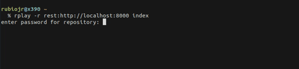
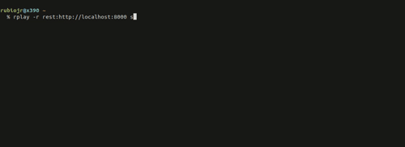
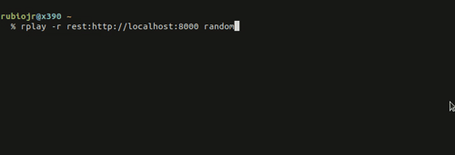

# RPlay

[](https://github.com/rubiojr/rplay/actions)
[](http://goreportcard.com/report/rubiojr/rplay)

A command line MP3 player for your [Restic repository](https://restic.net).

## Features

* Index and play available audio files (flac, mp3, ogg)
* ID3 metadata support
* Search your music collection (filename or ID3 tag)
* Support for indexing multiple Restic repositories
* Random, endless playback
* Optionally fetch missing song metadata (artist, album, etc) from Internet (see [ACOUSTICID.md](docs/ACOUSTICID.md))
* macOS and Linux supported

## Installation

Binaries for Linux are available in [the releases page](https://github.com/rubiojr/rplay/releases/latest).

You'll need to build from source for macOS and other Linux architectures:

```
GO111MODULE=on go get -u github.com/rubiojr/rplay
```

Or clone the repository and run `go build`.

## Usage

### ⚠️ A word of caution

RPlay does not encrypt the index created, meaning that the following information from your Restic repository will be available to those with access to the index:

* MP3 file names and ID3 metadata
* Repository ID
* Repository location

### Indexing your MP3

The first thing we need to do, is to index the repository:



Indexing yields some stats while indexing:

```
⢿ Taco Tuesday.mp3          🎯 62 new, 0 skipped, 0 errors, 11 f/s, 0.02 minutes left
```

_file being indexed, indexed files count, already indexed, indexing speed, remaining time_

and when the indexing process finishes:

```
💥 74 indexed, 0 already present. Took 5 seconds.
```

Worth noting also that RPlay accepts the same repository (the `-r` flag) URIs and backends [Restic does](https://restic.readthedocs.io/en/stable/030_preparing_a_new_repo.html), which means S3, rest-server, Backblaze, etc are all supported.

The indexing process will create an index in a OS specific path:

**Linux**

`~/.local/share/rplay`

**MacOS**

`~/Library/Application Support/rplay`

### Searching our collection

The `search` command will search our indexed files (filename searching only for now):



### Playing our tunes

Once we have indexed our repository, we're ready to play:



The play command also supports playing a specific file:

```
$ rplay -r rest:http://localhost:8000 search "*playa*"
Searching for *playa*...
ID:                  e6a9a3e7e630744cd6bcfd0820a25f7b9b467c5d472f7d0f1bd443103f1fa35c
Album:               La Playa
Artist:              DJ ALEX
Filename:            La Playa.mp3
Genre:               unknown
Title:               La Playa
Year:                20190718
```

```
rplay -r rest:http://localhost:8000 play e6a9a3e7e630744cd6bcfd0820a25f7b9b467c5d472f7d0f1bd443103f1fa35c
Playing e6a9a3e7e630744cd6bcfd0820a25f7b9b467c5d472f7d0f1bd443103f1fa35c...

⣾ Next song found, loading...
album:               La Playa
artist:              DJ ALEX
filename:            La Playa.mp3
genre:
title:               La Playa
year:                20190718
```

### Environment variables

RPlay supports configuring Restic's repository location and credentials via environment variables, so you don't have to type the URI and password all the time:

```
export RESTIC_REPOSITORY=rest:http://localhost:8000
export RESTIC_PASSWORD=secret
```

## Roadmap

* Better curses UI
* Flag songs as hidden/unwanted

## Credits

RPlay is an experiment quickly built in a few days thanks to the following projects that power it:

* [restic](https://restic.net) (via [RAPI](https://github.com/rubiojr/rapi))
* [go-mp3](https://github.com/hajimehoshi/go-mp3)
* [oto](https://github.com/hajimehoshi/oto)
* [urfave/cli](https://github.com/urfave/cli)
* [bluge](https://github.com/blugelabs/bluge)
* [go-app-paths](https://github.com/muesli/go-app-paths)
* [reflow](https://github.com/muesli/reflow)
* [termenv](https://github.com/muesli/termenv)
* [spinner](https://github.com/briandowns/spinner)
