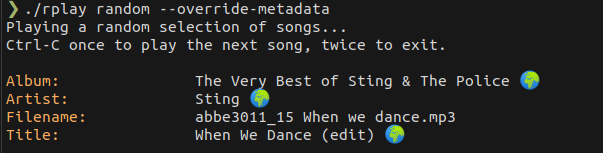

# Audio Fingerprinting

RPlay can fingerprint the audio files being played and fix audio metadata (album, title, artist, etc) automatically using the acoustid.org service. Internet access is required to use this feature.

You'll need [Chromaprint](https://acoustid.org/chromaprint) tools (`fpcalc`) installed to be able to use the feature.

In Debian/Ubuntu, you can install it using APT:

```
apt install libchromaprint-tools
```

**The feature is disabled by default** to preserve the user's privacy. To enable it:

```
rplay random --fetch-metadata
```

`--fetch-metadata` will fix missing metadata.
If you want to override all the metadata with the metadata obtained from the network, use `--override-metadata`:

```
rplay random --override-metadata
```

Playing a song no will display a 🌍 alongside the metadata updated if it's been retrieved from acoustid.org:



The metadata fetched is stored on disk permanently, so fetching metadata from the network won't be required a second time if the song has been played before with `--fetch-metadata` or `--override-metadata` enabled.
